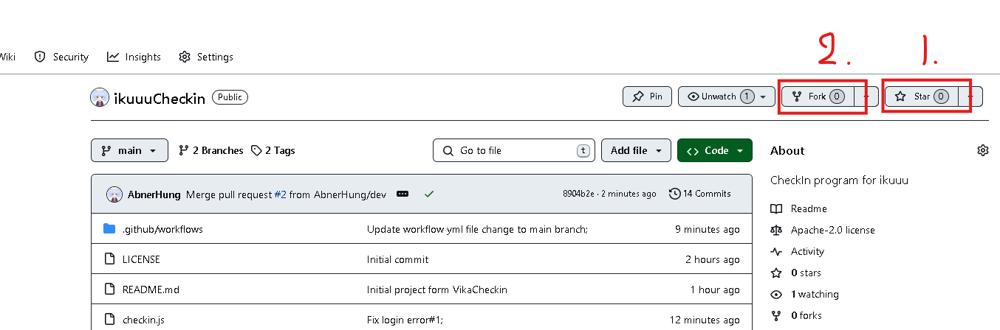
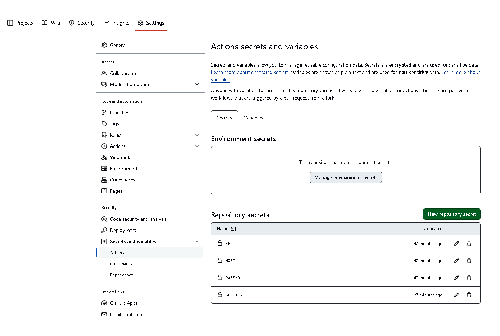
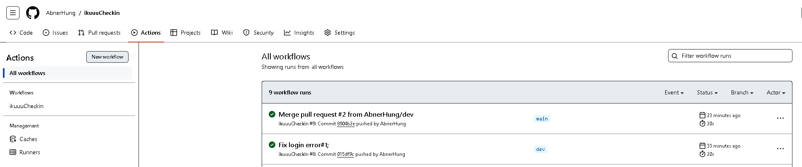

# ikuuu-Checkin

使用Github Action定时每天签到获取积分，推送至微信

亮点：

- 无需服务器
- 只需一次配置，后续自动运行
- 如果ikuuu更改地址，直接更新secret即可，无需改代码
- 消息可推送到微信

部署方法outline：

- Fork此项目
- 找到server酱的SENDKEY
- 配置项目secrets
- 开启workflow

## Setp1：Fork此项目

点击fork（求顺手点star😘）

## Setp2：server酱

### 拿到SENDKEY

直接搜索一波server酱，注册它，复制SendKey，记下来

## Setp3：在自己fork下来的repo的Settings里配置secrets

 按照下表填写：

| name    | secret                        |
| ------- | ----------------------------- |
| EMAIL   | 账号邮箱                      |
| HOST    | ikuuu最新的地址，如`ikuuu.pw` |
| PASSWD  | 账号密码                      |
| SENDKEY | 上一步拿到的Sendkey           |

配置好是这样的： 

## Setp4：开启workflow

点Actions，开启workflow，配置文件是`.github/workflows/checkin.yml` 开启后是这样的（左边有个ikuuuCheckin）：

开启之后每天早上九点半左右会收到签到信息

## 遇到问题请在issue中反馈

## 更新日志：

- Version 1.0：初版，COOKIE填到secret里
- Version 1.1：完整版，配置用户名密码，自动登录签到
- Version 1.2：更新了文档
